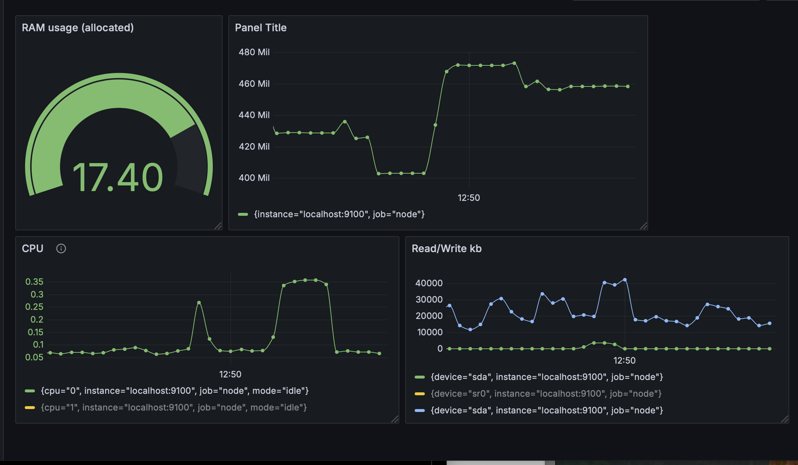
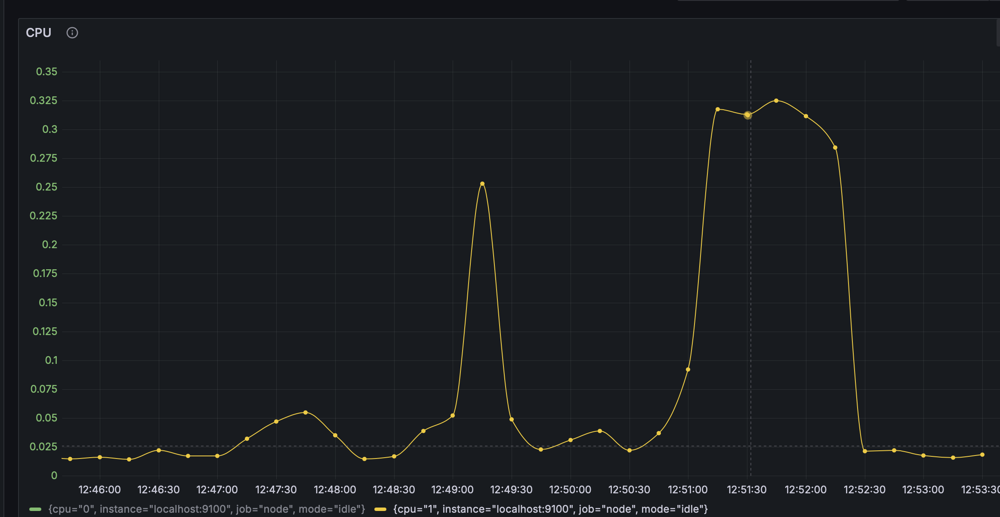
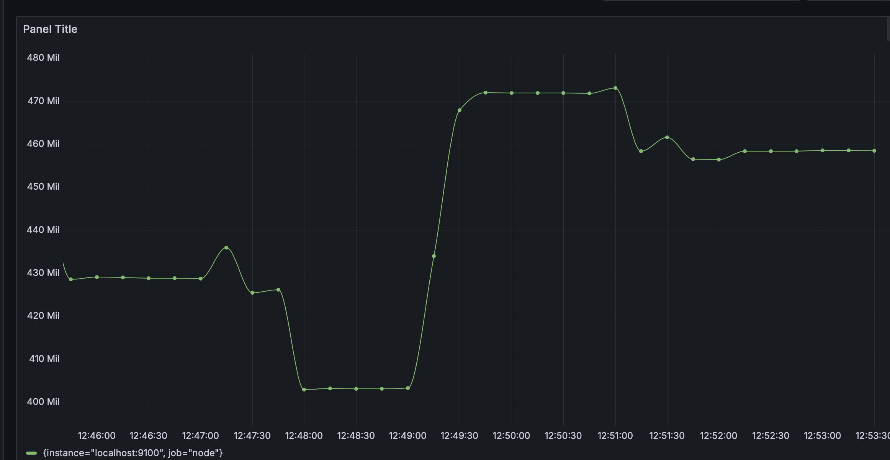
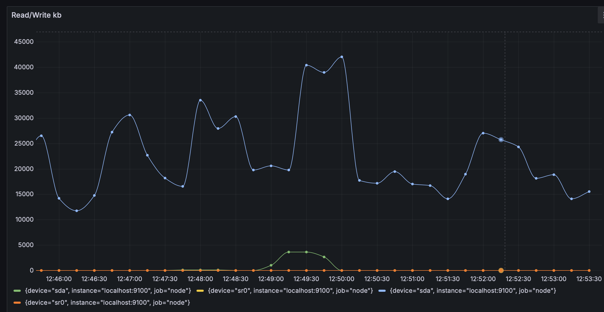

#### На скрине можно увидеть как себя повели различные системы виртуальной машины



Запуск скрипта произошел в 12:49 (повторный запуск скрипта был в промежутке между 12:52 и 12:55), на дашборде можно наблюдать активность таких систем как загрузка CPU, RAM и процессов считывания/записи.

Ниже можно посмотреть, какие именно метрики были использованы для создания дашборда:

CPU:

```
(1 - rate(node_cpu_seconds_total{job="node", mode="idle", instance="localhost:9100"}[30s]))
/ ignoring(cpu) group_left
  count without (cpu)( node_cpu_seconds_total{job="node", mode="idle", instance="localhost:9100"})

```
RAM Usage:

```
(
  node_memory_MemTotal_bytes{job="node", instance="localhost:9100"}
-
  node_memory_MemFree_bytes{job="node", instance="localhost:9100"}
-
  node_memory_Buffers_bytes{job="node", instance="localhost:9100"}
-
  node_memory_Cached_bytes{job="node", instance="localhost:9100"}
)
```

Read/Write bytes amount:

```
rate(node_disk_read_bytes_total{job="node", instance="localhost:9100", device!=""}[60s])

rate(node_disk_written_bytes_total{job="node", instance="localhost:9100", device!=""}[60s])

```