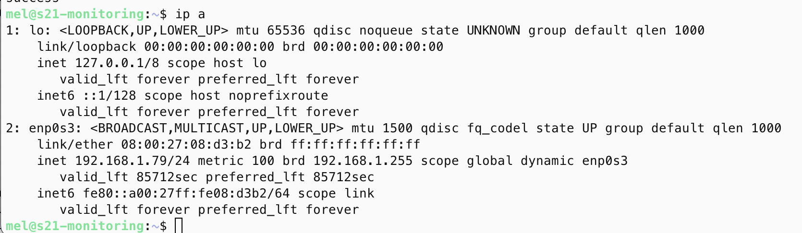
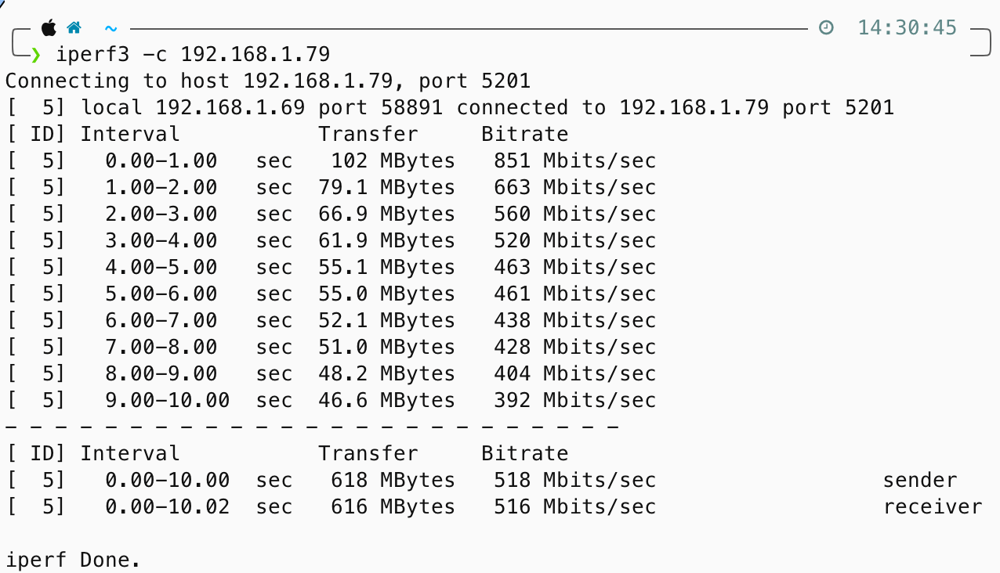

#### Cтандартный дашборд *Node Exporter Quickstart and Dashboard*:
На скрине видно, как ведут себя системы виртуальной машины, при использовании скрипта (скрипт был запущен в 13:51):

#### Также в задание входило проверить, как снимаются метрики нагрузки сети:
На скриннах представлены данные6 которые были использованы для работы утилиты iperf3
| server | client |
| ------ | ------ |
|  |  |

На скрине представлен вывод дашборда:
